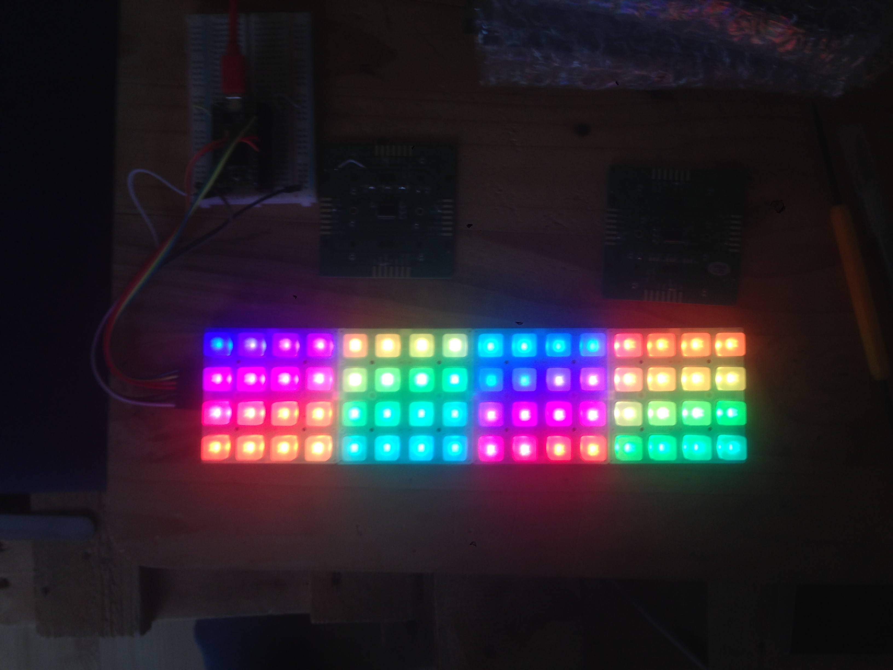

# DADA_Grid

## This is a library for the DADA Grid 4x4 PCB 

The Design of the PCB and the Library is based on the Design of Adafruit Trellis PCB.
Adafruit invests time and resources providing this open source code, 
please support Adafruit and open-source hardware by purchasing 
products from Adafruit!
Arduino library Written by Limor Fried for Adafruit Industries.

Rewritten by Steffen Sennert for DADA.

## i2c Addresses 0x20-0x27
up to 8 PCB can share the same I2C Bus to communicate, 2 pins are required to interface, 
i2c Address must be set by the solder jumpers on the back of the PCB. 

To use more more than 8 PCBs you can use a second i2c Bus. The Library currently only supports this on the Teensy with the i2c_t3 Library by nox771 :
- https://github.com/nox771/i2c_t3

## LEDs
The APA102 RGB LEDs use additional 2 lines for DATA and CLK Signals
Example Sketches use the FastLED Library to control the RGB LEDs:
- https://github.com/FastLED/FastLED

## Demo Rainbow with 4 DADA Grid PCBs

